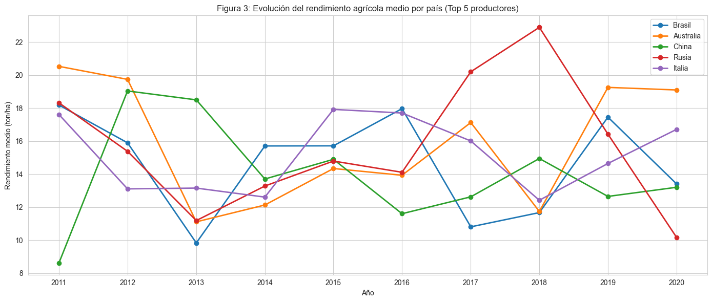
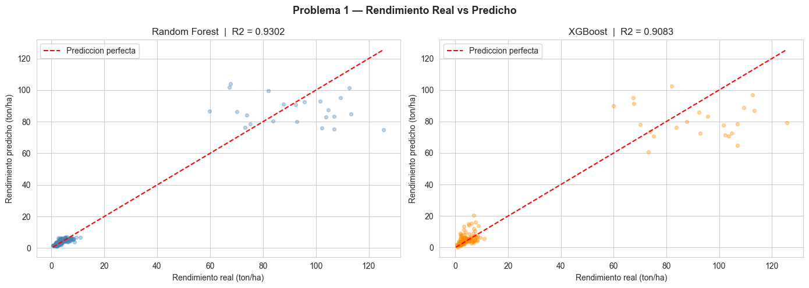
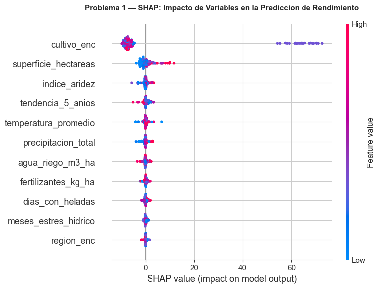
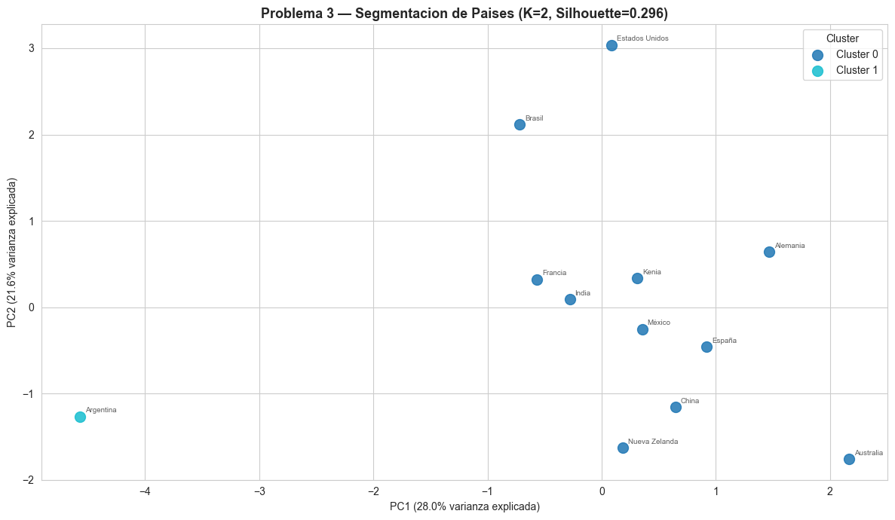
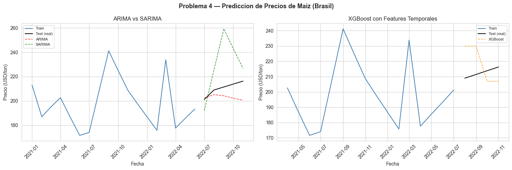

# 🌾 Agro Analytics — ETL, Machine Learning y Dashboard Power BI

Pipeline completo de datos sobre **agricultura y ganadería global**: ingesta de datos estructurados, semi-estructurados y no estructurados → ETL y limpieza → EDA → 6 problemas de Machine Learning → NLP sobre noticias → dashboard en **Power BI** que responde a preguntas de negocio reales.



## El pipeline

```
data/raw (CSV, JSON, texto)  →  ETL + limpieza  →  data/processed  →  EDA + ML + NLP  →  data/exports_powerbi  →  Dashboard .pbix
```

1. **ETL** — carga y transformación de fuentes heterogéneas: CSV estructurados (producción agrícola/ganadera, precios, clima), semi-estructurados (JSON de configuración, metadatos) y no estructurados (noticias agrícolas en texto libre).
2. **EDA** — correlaciones de producción agrícola, tendencias temporales, ganadería vs emisiones, precios de mercado, clima, plagas y subsidios (37 figuras en `docs/figuras/`).
3. **Machine Learning** — 6 problemas resueltos:

| # | Problema | Técnica |
|---|---|---|
| 1 | Predicción de rendimiento agrícola | Regresión (+ SHAP para explicabilidad) |
| 2 | Clasificación del riesgo de plagas | Clasificación (matriz de confusión, curvas ROC) |
| 3 | Segmentación de países por patrones productivos | Clustering (K-Means, elbow + silhouette, PCA) |
| 4 | Predicción de precios de mercado | Series temporales |
| 5 | Detección de anomalías en producción | Detección de outliers |
| 6 | Recomendación de cultivos | Clasificación comparativa |

4. **NLP** — sobre las noticias agrícolas: NER, análisis de sentimiento, topic modeling y correlación del sentimiento con los precios de mercado.
5. **Power BI** — `docs/TRABAJO_FINAL.pbix` consume los CSV de `data/exports_powerbi/` y responde a las preguntas de negocio.

## Preguntas de negocio respondidas

- ¿Dónde realizar una explotación agrícola para obtener un beneficio del 5–10 %?
- ¿Dónde realizar una explotación ganadera con el mismo objetivo?
- ¿Cuántas hectáreas y qué cultivo maximizan el rendimiento?
- ¿Cuántas cabezas de ganado y de qué tipo maximizan el rendimiento?
- ¿Qué región/país cumple varios de los criterios anteriores?
- ¿Existe un plazo óptimo para obtener el mayor rendimiento?

## Algunas figuras

| | |
|---|---|
|  |  |
|  |  |

## Estructura

```
├── notebooks/01_etl_eda.ipynb    # Notebook principal: ETL + EDA + ML + NLP + respuestas
├── data/
│   ├── raw/                      # Fuentes originales (estructurado / semi / no estructurado)
│   ├── processed/                # Datos limpios tras el ETL
│   └── exports_powerbi/          # Tablas agregadas que consume el dashboard
├── docs/
│   ├── TRABAJO_FINAL.pbix        # Dashboard Power BI
│   ├── figuras/                  # 37 figuras generadas por el análisis
│   └── Documento_*.docx          # Memoria del proyecto
└── requirements.txt
```

## Ejecutar

```bash
pip install -r requirements.txt
jupyter lab notebooks/01_etl_eda.ipynb
```

El dashboard se abre con **Power BI Desktop** (`docs/TRABAJO_FINAL.pbix`).

## Stack

`Python` · `pandas` · `scikit-learn` · `XGBoost` · `LightGBM` · `SHAP` · `statsmodels` · `spaCy/NLTK` · `matplotlib/seaborn/plotly` · `Power BI`

## Autores

**Marcos Pérez Esteban** y **Marcos Guerrero** — proyecto final del Curso de Especialización en Inteligencia Artificial y Big Data.
# agro-etl-powerbi
# agro-etl-powerbi
# agro-etl-powerbi
# agro-etl-powerbi
